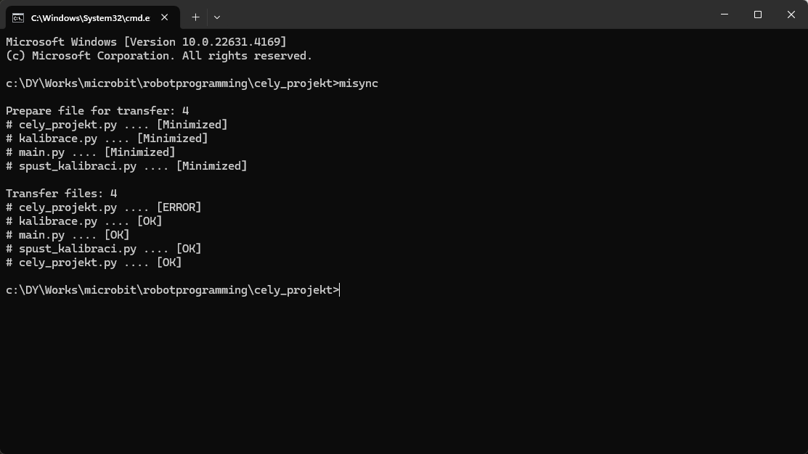

# Microbit Syncer Batch Script

This is a Windows batch script designed to sync Python files to a Microbit device.
It includes functionalities for file preparation, file transfer, and optional cleaning of the Microbit memory.
The script also supports optional parameters for quick transfer, cleanup, and displaying help.

## Requirements

- **[MicroFS](https://microfs.readthedocs.io/en/latest/)**: A simple command line tool and module for interacting with the limited file system provided by MicroPython on the BBC micro:bit.
- **[python-minifier](https://pypi.org/project/python-minifier/)**: Transforms Python source code into its most compact representation.

```code
pip install microfs
pip install python-minifier
```

## Recommendation
### Windows user
For convenient use, add the path to the misync.exe file to the PATH environment variable in Windows. You can add it by running the <em>windows/add-path.cmd</em> script as a administrator

## Usage

Run the script from the command line with optional parameters to control its behavior:

```bash
misync [parameters]
misync h
```


### Parameters
- <code>/q</code>, <code>/quick</code>, <code>--quick</code> or <code>q</code>: Enables quick transfer mode. Only files with changes in their SHA1 hash will be transferred.
- <code>/c</code>, <code>/clean</code>, <code>--clean</code> or <code>c</code>: Cleans the Microbit device by removing all files from its memory before transfer.
- <code>/h</code>, <code>/help</code>, <code>/?</code>, <code>--help</code> or <code>h</code>: Displays help information about the script and its available parameters.
